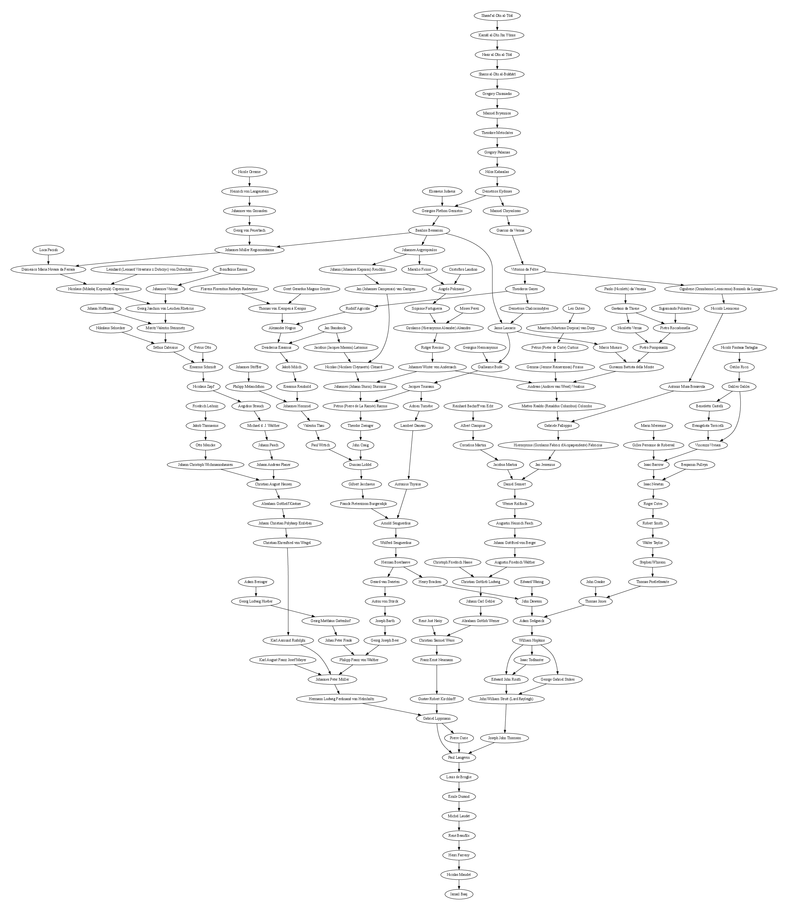

# Scientific Geneaology 

It took me several months to find my scientific genealogy. 
Here are some useful resources to find your scientific genealogy:
- https://academictree.org/
- https://mathgenealogy.org/ (90% of my tree comes from this site)
- theses.fr
- idref 
- Worldcat
- Bibliothèque National de France (BNF): I had to contact the BNF to get a scan of the first pages of a thesis
- Borrowing dissertations from university libraries
- HAL open archives 
- Henrion, Didier. "Sur ma généalogie scientifique française." (2010). [https://homepages.laas.fr/henrion/papers/genealogie-henrion.pdf](https://homepages.laas.fr/henrion/papers/genealogie-henrion.pdf)

In this repository, we can find two python scripts:
- parsing.py : to crawl mathgenealogy.org (be quiet!)
- plot.py : plot your academic tree.

wtfpl
